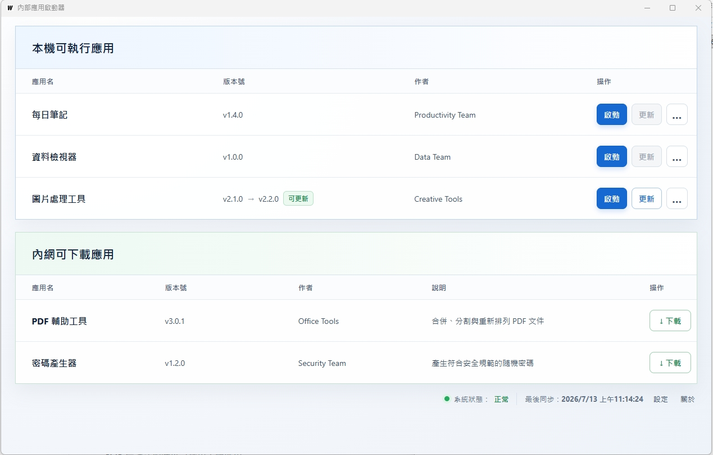

# intra-launch

intra-launch 是公司內網使用的輕量桌面啟動器，讓使用者從單一入口下載、更新、修復及啟動內部 portable 應用。

專案以 Go、Wails 與 Vanilla JavaScript 開發，應用來源限定為公司內網 SMB，不需要額外的 HTTP 服務或安裝系統。

## 主畫面



## 主要功能

- 離線掃描並啟動本機已同步應用。
- 從 SMB `catalog.json` 列出可下載應用。
- 以版本字串差異提示更新。
- 支援下載、更新、修復及解除安裝。
- 同步期間顯示完成檔案數與經過時間，並可安全取消。
- 使用 staging 目錄完成同步後再替換正式應用，避免半成品覆蓋既有版本。
- 啟動時清除中斷同步留下的 staging 與 backup 目錄。
- Launcher 僅允許單一實例執行。
- SMB 無法連線時仍可使用本機應用。

## 部署方式

### 客戶端部署

#### 方式一：手動部署設定檔

1. 將設定檔放在 `%UserProfile%\intra-launch\config.json`：

   ```json
   {
     "smbBasePath": "\\\\server\\apps",
     "smbUsername": "readonly-user",
     "smbPassword": "password"
   }
   ```

2. 將 `intra-launch.exe` 放在使用者可存取的位置並執行，不需要安裝或系統管理員權限。

#### 方式二：將預設設定編譯進執行檔

1. 修改 `internal/settings/config.go` 中的預設 SMB 連線設定。

2. 重新編譯 `intra-launch.exe` 並部署至客戶端。若 `%UserProfile%\intra-launch\config.json` 不存在，程式會以內建預設值自動建立；既有設定檔不會被覆蓋。

SMB 帳密以明文保存，請使用權限受限的唯讀帳號，並限制設定檔存取權限。本機應用會同步至 `%UserProfile%\intra-launch`，即使 SMB 暫時無法連線，仍可啟動已下載的應用。

`syncWorkers` 控制同步時的並行檔案數，預設為 `4`，可設定為 `1` 到 `16`。大量小檔可視 SMB 與用戶端負載調整；建議先維持預設值。

### 主機端部署

1. 建立用於發佈應用的 SMB Share，並準備一組可讀取目錄與檔案的唯讀帳號。
2. 在 SMB 根目錄放置 `catalog.json`，再以每個應用的 `id` 建立同名目錄：

```text
\\server\apps\
  catalog.json
  report-system\
    ReportSystem.exe
  ops-toolkit\
    bin\
      OpsToolkit.exe
```

3. 在 `catalog.json` 登記應用資訊：

```json
{
  "version": "1",
  "apps": [
    {
      "id": "sample-app",
      "name": "範例應用",
      "version": "v1150709",
      "author": "IT Team",
      "description": "範例 portable 應用",
      "executable": "SampleApp.exe"
    }
  ]
}
```

`id` 必須能作為目錄名稱；`executable` 是相對於應用目錄的執行檔路徑。所有應用都必須是免安裝、自帶執行環境的 portable 應用。版本只比較字串是否不同，不判斷新舊。

設定檔與 catalog 範例可參考 [`templates/`](templates/) 目錄。

### 應用程式增刪

- 新增應用：將 portable 應用放入以 `id` 命名的目錄，並在 `catalog.json` 的 `apps` 加入對應資料。
- 更新應用：替換該應用目錄內容，並修改 `catalog.json` 的版本與相關資訊；版本字串不同時，客戶端才會顯示可更新。
- 移除應用：從 `catalog.json` 刪除項目，再刪除 SMB 上的應用目錄。已下載至客戶端的應用不會自動刪除，仍可由使用者手動解除安裝。

## 開發與建置

需求：

- Go 1.26+
- Node.js 24+
- Wails CLI 2.12+

啟動開發模式：

```powershell
Set-Location frontend
npm install
Set-Location ..
wails dev
```

執行測試：

```powershell
go test ./...
```

建立 Windows 執行檔：

```powershell
wails build
```

輸出位置為 `build/bin/intra-launch.exe`。

## 授權

本專案採用 [MIT License](LICENSE)。
